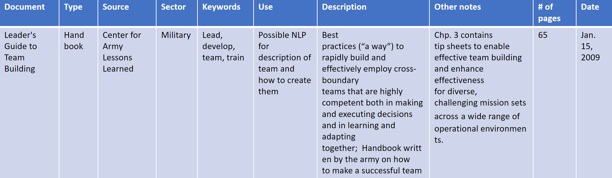

# Qualitative Analysis Data
###*Document Review*
A list of 55 documents from the Army and external sources that pertained to the role of an individual in unit performance were collected. The author, keywords, uses, a description, date written, and any notes were collected for each document to aid in the document selection for the qualitative analysis. Green highlighted documents titles indicate possible relevance to research topic and yellow highlighted document names were the 10 documents used in the qualitative analysis. The chart below shows one example of how a document was reviewed.
The document discovery can be found [here](https://github.com/uva-bi-sdad/dspg22ari2/tree/main/data/excel).

###*Corpus*
10 documents were selected to be from a variety of sources, sectors, and time periods. Documents related to Army Leadership and Team Science spanning over the last 50 years were chosen. The documents selected can be found [here](https://github.com/uva-bi-sdad/dspg22ari2/tree/main/data/yellow).

**Selected Document**  

- PAM 623-3: Evaluation Reporting System  

- AR-623-23: Performance Evaluation Guide - Leadership Requirements Model and Example Behavioral Indicators  

- PAM 600-3: Officer Professional Development and Career Management  

- What Makes Teams Work: Group Effectiveness Research from the Shop Floor  

- The Relationship Between Organizational Characteristics and Team Building Success  

- Building Cohesive Teams Handbook  

- ADP 6-22: Army Leadership and the Profession 

- Leaders Guide to Team Building Handbooks 

- FM 6-22: Leader Development   

- TC 7-21.13: Soldier’s Guide  

####*Army documents:*

We define official Army documents as documents officially published by the Army (Department of Army Authenticated Publications). More specifically, we analyze seven types of Army Administrative Documents: 

**Army Directive (AD)**   
- A directive or information memorandum issued by the Secretary of the Army (SECARMY) to establish or change policy or guidance for distribution and applicability Army wide (Department of Deference Publication Definitions)

**Army Regulation (AR)**   
- A publication that sets forth missions, responsibilities, and policies; delegates authority; sets objectives; and prescribes mandated procedures to ensure uniform compliance with those policies. 

**Department of the Army (DA) pamphlet (PAM)**   
- A permanent instructional publication. Unless mandated in an AR, procedures established in a DA pamphlet are for guidance only and to establish optional or helpful methods of performing mission and functions, define probable courses of action, and explain how something is affected. 

**Army Doctrine Publications (ADP)**   
- Address fundamental principles by which operating forces and elements of generating force that directly supports operations guide their actions in support of national objectives. 

**Handbook**   
- Explains techniques as opposed to principles. Handbooks tend to be more detailed and specific and provide a method for accomplishing a task. Its goal is to give information on a specific topic as a reference. 

**Field Manual (FM)**   
- Published by the United States Army's Army Publishing Directorate and contains detailed information and how-tos for procedures important to soldiers serving in the field. FM contains principles, tactics, procedures, and other doctrinal information that describes how the Army and its organization conduct operations and train for those operations.

**Training Circulars (TC)**   
- A permanent publication that provides a means to distribute unit or individual Soldier training information that does not fit standard requirements for other established types of training publications 

####*Non-Army documents:*

Official Army documents were analyzed to understand individual characteristics of that lead to unit performance from the perspective of the Army. The Army has very different definitions of team success than civilian teams, so the individual characteristics related to success may be specific to the Army. Non-Army documents were also analyzed to see if there are individual characteristics known to lead to success that the Army does not already consider. 

**What Makes Teams Work: Group Effectiveness Research from the Shop Floor**   
- A publication by researchers at the University of Southern California exploring a heuristic framework illustrating recent trends in depiction of team effectiveness, group, and organization design factors, environmental factors, internal processes, external processes, and group psycho-social traits written for the general public and other academics 

**The Relationship Between Organizational Characteristics and Team Building Success**   
- A publication by researchers at the University of Akron exploring the influence of organizational structure and team building on work group effectiveness written for the general public and other academics 

###*Excerpts*
A full list of all 320 excerpts can be found [here](https://github.com/uva-bi-sdad/dspg22ari2/tree/main/data/excel).

# Natural Language Processing Data

The same corpus of 10 documents was used to complete multiple NLP techinques. To complete these, the corpus of documents was cleaned making all of the words lowercase, removing non-alphabetic characters, and removing all words less than three words. Three letters was selected to be the limit as words at or below this level did not contribute to the overall meaning of the documents when standing alone. None of the tests conducted took location of a word in a sentence into account, so removing these words had little to no effect on the outcomes.

