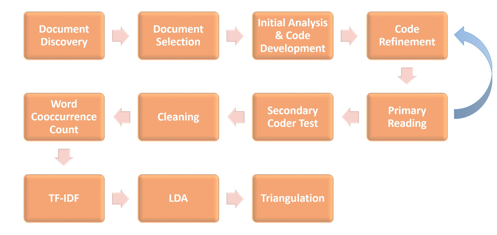

<p align="center">  

{width=70%}  
</p>   

#**1. Document Discovery**  
{fig.align='center'}
A list of 55 documents from the Army and external sources pertaining to the role of an individual in unit performance were collected. The author, keywords, potential for use in our analyses, detailed document description, date written, and notes were annotated for each document. [1]   

#**2. Document Selection**
The research team collectively decided on 10 documents most relevant to our question of interest, as it relates to leadership in the Army and team science, for further analysis. [2]

#**3. Initial Analysis & Code Development**  
The 10 documents in the corpus were read a first time to identify emergent themes (i.e., themes about which there were no a priori expectations). A literature review was also conducted to determine possible biases that would influence the documents.

Possible Biases:  

- Historic Army recruitment tests reinforced institutional bias and maintained segregation. Due to Jim Crow laws, black recruits had not received the same education.  

- Until August 2014, a row of chairs was placed behind the female platoon at Marine recruit training for recruits who were too exhausted to stand, despite completing boot camp under the same conditions and requirements as their male peers.  

- “Don’t ask, don’t tell” policy, which barred openly LGBTQIA+ persons from joining the military, was lifted September 20th, 2011. The law claimed, among other things, their presence would “create a risk (…) to unit cohesion.”


#**4. Code Refinement**  
After all of the documents were read, the codes were refined. Similarly themed codes were consolidated into a single code, for a final list of 18 major codes to use in the document analysis.

<p align="center">  

  
</p>   


#**5. Primary Reading**  
<p align="center">  

{width=60%}
</p>   


Once the codes were selected, each document was read in its entirety using Dedoose. Three hundred twenty (320) excerpts were identified. The excerpts were tagged with 506 applications of the 18 codes.  

#**6. Secondary Coder Test**   
Tests were conducted on Dedoose to measure inter-coder reliability. Readers outside of the project reviewed selected excerpts and applied the 18 codes. Their responses were analyzed to see how often the codes they choose matched those of the initial coder.

<p align="center">  

{width=90%}  
</p>   
  

#**7. Cleaning**  
<p align="center">  
{width=40%}  
</p>  

The same corpus of documents was analyzed using Natural Language Processing (NLP). To begin the NLP, the corpus was uploaded as text files into R Studio and the documents were cleaned (e.g., all words were coverted to lowercase letters, non-alphabetic characters were removed). All words with fewer than four letters were removed, as words below this limit did not contribute to overall meaning in the documents. The NLP techniques used in this analysis did not take location of a word in a sentence into account, so removing these words had little to no effect on the outcomes. Last names were also removed. Finally, all words were legitimatized. Legitimization groups together multiple forms of the same word so that they can be analyzed as a single concept (e.g., running and runs become run). [3]
   
#**8. Word Cooccurence Test**  
The corpus was split into documents and then paragraphs. The words in each paragraph were tokenized and the paragraph to which they belong was recorded. The amount of times word pairs occurred in each paragraph were recorded and the highest occurrences were recorded. [4]
```{r, layout="l-body-outset", echo = FALSE}
library(rmarkdown)
paged_table(readRDS("/home/jme6bk/github/dspg22ari2/src/web/RDS/cooccurence.RDS"))
```

#**9. Term Frequency-Inverse Document Frequency (TF-IDF)**  
The term frequency-inverse document frequency was recorded for each document. TF-IDF is calculated by multiplying the number of times each word appears in a given document and the inverse document frequency of the word in the corpus of documents. The final set of words shows which terms make each document unique from other documents in the corpus. [5] 
```{r, layout="l-body-outset", echo = FALSE}
library(rmarkdown)
paged_table(readRDS("/home/jme6bk/github/dspg22ari2/src/web/RDS/desc_tf_idf.RDS"), options = list(cols.print = 3))
```

#**10. Latent Dirichlet Allocation (LDA)**  
Latent Dirichlet Allocation is a form of topic modeling that is used to find topics within a corpus of documents and identify the words associated with each topic. The number of topics to search for is a parameter set by the researcher. For the purpose of this project, we selected 18 topics as we identified 18 codes when manually reading the documents. [6] 
```{r, layout="l-body-outset", echo = FALSE}
library(rmarkdown)
paged_table(readRDS("/home/jme6bk/github/dspg22ari2/src/web/RDS/top_terms_rename.RDS"))
```

#**11. Triangulation**  
Based on the LDA model, codes were matched with the topics to see if the manually labeled documents coincided with the natural language processing.  
  
#**12. Next steps**  
In the future, the corpus of documents to be manually coded and analyzed through NLP will be expanded to include additional documents of interest identified during document discovery. Additionally, the results from this analysis will be transitioned to related  research efforts to inform quantitative models being developed to study individual Soldier and unit performance.  
 
 
--------------------------------------------------
1. [Document Discovery](https://github.com/uva-bi-sdad/dspg22ari2/tree/main/data/excel) 

2. [Documents](https://github.com/uva-bi-sdad/dspg22ari2/tree/main/data/yellow)

3. [NLP Cleaning](https://github.com/uva-bi-sdad/dspg22ari2/blob/main/data/Code/cleaning.R)  

4. [Co-occurence](https://github.com/uva-bi-sdad/dspg22ari2/blob/main/data/Code/analysis.R)  

5. [TF- IDF](https://github.com/uva-bi-sdad/dspg22ari2/blob/main/data/Code/analysis.R)  

6. [LDA](https://github.com/uva-bi-sdad/dspg22ari2/blob/main/data/Code/analysis.R)

