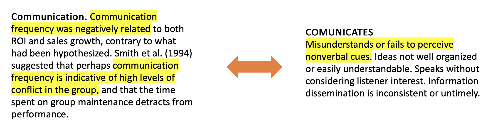
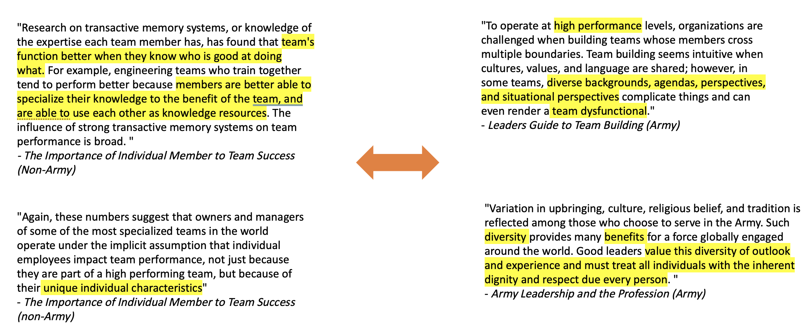
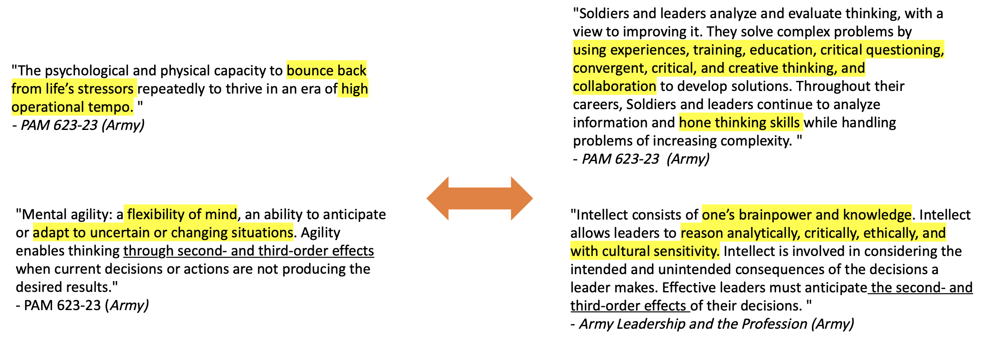

###*Codes*

Below is complete list of the 18 final codes used in the qualitative analysis. You can sort the codes alphabetically by name, whether the code was emergent or a topic we believed would be important a priori, or by a complete definition.

```{r, layout="l-body-outset", echo = FALSE}
library(DT)
datatable(readRDS("/home/js2mr/git/dspg22ari2/src/web/RDS/themes_detailed.RDS"), options = list(
  pageLength = 18
  ))

```

Below, we highlight noteworthy findings from our analysis with a deeper examination of several converging and diverging themes from across multiple documents.

###*Negative Qualities vs. Negation of Positive Qualities*
One difficult and reoccurring issue to code was how to handle qualities that could positively or negatively impact team performance depending on the amount and quality of the quality. For example, the excerpt on the left highlights a situation in which too much communication was associated with negative team outcomes (i.e., communication was seen as a ‘negative quality’ for a group to possess). The excerpt on the right highlights the opposite case, instances where too little (or a lack of) communication and/or poor-quality communication is associated with negative team performance. Taken together, we see that communication is a crucial element in determining team success, but that there is an important contextual element to understanding exactly how communication affects success. For example, if someone is a poor communicator and a team is suffering for it, simply instructing the individual to communicate more is unlikely to resolve the issue. In fact, it could make the situation worse. 



###*Diversity in Background vs. Diversity in Skill*
An interesting and important point of divergence between the Army and non-Army literature focused on the use of the word ‘diversity.’ In the excerpt on the left, from a non-Army document, we see evidence for how diversity in individual skill sets can contribute to better team performance. However, Army document references diversity as it relates to individuals’ background, upbringing, and culture noting how divergent backgrounds could make team building more complicated and negatively impact team performance.



###*Adaptability vs. Intellectual Efficiency*
The following excerpts were all taken from Army documents. The excerpts on the left were coded as 'Adaptability' while the excerpts on the right were coded as 'Intellectual Efficiency.' Distinguishing between these two codes proved difficult during the qualitative analysis because, as is highlighted in the underlined segments, the Army defines both qualities using similar language. Ultimately, we refined our coding scheme to distinguish between the two through the use of language such as that highlighted in yellow. We determined that to be ‘adaptable’ one must be able to think critically, while ‘intellectual efficiency’ rests on a person's ability to analyze and process information to include efficiency in skill. Efficiency in skill includes experiences, training, education, and so on (as highlighted in the top right excerpt), which are not necessarily required in order to be adaptable. Intellectual efficiency includes reasoning and brain power, while adaptability making quick decisions and flexibility thinking, which is crucial for a Soldier to thrive in a 'high operational tempo.’


